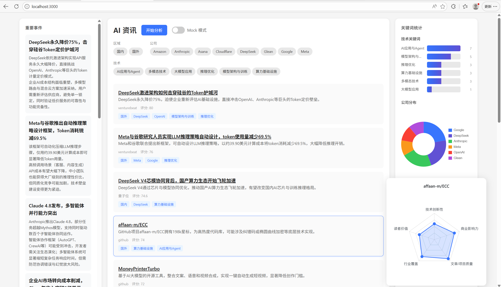

# AI 资讯日报可视化

AI 资讯日报的智能分析与可视化系统，通过 LLM 对原始文章进行评分、摘要、关键词提取和归因分析，生成结构化简报。



## 数据源说明

### 来源

- 原始数据来自 `server/data.json`，由人工筛选入库
- 每篇文章包含：link、title、abstract、publishTime、source、content

### 选择依据

- **中英文结合**：兼顾国内动态和海外资讯
- **来源广泛**：涵盖新闻网站、博客、GitHub Trending 等
- **多样化**：GitHub Trending 上的开源项目和 AI 资讯不太一样，需要单独关注

### 数据特点

- 多语言混合（中文/英文标题和摘要）
- 来源多样（不同媒体风格迥异）
- GitHub Trending 与传统 AI 资讯关注点不同

## 系统设计思路

### 整体架构

```
前端 (HTML/JS/CSS + Chart.js)
    ↑ fetch API ↑
后端 (Node.js/Express)
    ↑ LLM API ↑
DeepSeek API (deepseek-v4-pro)
```

### 关键决策

1. **前后端分离**：前端纯静态文件，后端提供 API
2. **Mock 模式**：支持跳过 LLM 调用，使用预存数据快速验证
3. **SSE 实时进度**：LLM 处理耗时较长，通过 Server-Sent Events 推送进度
4. **结果缓存**：LLM 处理结果存入 llmData.json，避免重复调用
5. **评分标准细化**：每个维度5级分段，减少评测波动

### 文件结构

```
/
├── assets/
│   └── image.png          # 页面截图
├── server/
│   ├── server.js          # Express 服务端
│   ├── llm.js             # LLM 调用封装
│   ├── package.json
│   ├── data.json          # 原始文章数据
│   ├── llmData.json       # LLM 处理结果
│   ├── mock.json          # 示例数据
│   └── public/             # 前端静态文件
└── README.md
```

## AI使用方式

### 三次 LLM 调用


| 调用               | 目的                 | 并行性 |  |
| ------------------ | -------------------- | ------ | - |
| Step 1: 文章评分   | 逐篇评分+摘要+关键词 | 并行   |  |
| Step 2: 关键词映射 | 统一关键词格式       | 单次   |  |
| Step 3: 总结生成   | 生成左侧简报         | 单次   |  |

---

### Step 1: 文章评分

**目的**：解决原始数据质量参差不齐的问题——标题可能是英文、摘要可能不够简洁、缺乏评分和结构化信息。通过 LLM 统一处理，生成中文标题、规范摘要、五维评分、关键词和补充信息。

**输入**：一篇文章的 title、abstract、source、stars（可选）

**输出**：

```json
{
  "translated_title": "中文标题（英文标题才需要翻译）",
  "summary": "40-50字中文摘要",
  "score": 78.5,
  "dimensions": {
    "innovation": 80,
    "business_impact": 75,
    "quality": 85,
    "industry_coverage": 70,
    "reader_value": 82
  },
  "keywords": {
    "regions": ["国外"],
    "companies": ["Anthropic"],
    "tech": ["LLM", "推理优化"],
    "products": ["Claude"]
  },
  "extras": ["风险信号描述", "成本变化描述"]
}
```

**设计思路**：

- 5维度各20%权重，通过细化分段标准保证一致性
- extras 面向读者而非AI模型公司，强调"对读者意味着什么"
- 没有的信息不硬凑，保持简洁

---

### Step 2: 关键词映射

**目的**：解决多人标注导致的关键词不一致问题——同一个技术可能有 LLM/LLM/VLLM 等不同写法，同一个公司可能被拆分成 Anthropic/Anthropic PBC 等。通过 LLM 统一格式，合并同义词，生成标准化映射表。

**输入**：所有文章的 keywords 汇总

**输出**：

```json
{
  "companies": { "映射前": "映射后" },
  "tech": { "LLM": "大语言模型", "KV Cache": "推理优化" },
  "products": { }
}
```

**设计思路**：

- 统一格式（token/Token → token）
- 合并同义词（KV Cache/PagedAttention/FlashAttention → 推理优化）
- 保留原始大小写作为 key，方便追溯

---

### Step 3: 总结生成

**目的**：解决信息过载问题——14篇文章堆在一起，读者难以快速抓住重点。通过 LLM 分析全部文章，提取最重要的事件、趋势、创意和风险，生成2-4条重点突出的简报，让读者快速了解今日要点。

**输入**：所有文章的完整数据（原始 + LLM 处理后）

**输出**：

```json
{
  "highlights": [
    {
      "event": "Anthropic 发布 Claude 4",
      "background": "新一代大语言模型",
      "impact": "对 AI 应用开发有重大影响"
    }
  ],
  "trends": ["开源模型崛起", "推理优化成为焦点"],
  "creative_ideas": ["尝试新模型进行 XX 场景"],
  "risks": ["模型输出可能不客观"]
}
```

**设计思路**：

- 2-4条重点突出，不贪多
- 每条讲清楚逻辑，不只描述现象
- 四象限结构：事件/趋势/创意/风险

---

### 完整 Prompt

#### 文章评分 Prompt（Step 1）

```
你是一个AI资讯评分专家。请根据用户提供的文章信息从以下维度评分，每项0-100，最终输出加权平均分（权重各20%）：

【评分标准细则 - 严格按此标准评分】

1. 技术创新性（0-100）：
   - 90-100：首创性技术突破、新范式、颠覆性架构创新
   - 70-89：有实质改进的新技术实现、知名项目重大版本更新
   - 50-69：新技术应用、已知技术的新组合
   - 30-49：对现有技术的增量优化、小幅改进
   - 0-29：常规更新、已知技术的简单引用

2. 商业影响力（0-100）：
   - 90-100：改变行业格局、对大型公司有重大影响、涉及亿美元以上
   - 70-89：影响特定市场段、对中型公司有显著影响
   - 50-69：对部分用户群体有可感知影响
   - 30-49：影响有限、边缘市场或小众用户
   - 0-29：几乎无商业影响

3. 文章/项目质量（0-100）：
   【评估内容质量 - 区分文章报道与 GitHub 项目】
   
   【文章质量评分标准】
   - 90-100：深度分析、首發报道、独家内容
   - 70-89：完整报道、重要事件综述
   - 50-69：常规新闻、资讯汇总
   - 30-49：简讯、片段信息
   - 0-29：注水内容、无实质信息

   【GitHub 项目质量评分标准 - stars 加分规则】
   - stars > 100k：顶级项目 → 88-93区间
   - stars 50k-100k：重要项目 → 80-87区间
   - stars 20k-50k：知名项目 → 72-79区间
   - stars 10k-20k：活跃项目 → 64-71区间
   - stars 5k-10k：新兴项目 → 56-63区间
   - stars 1k-5k：起步项目 → 48-55区间
   - stars 500-1k：基础项目 → 40-47区间
   - stars 100-500：小众项目 → 32-39区间
   - stars < 100：基础分不变

4. 行业覆盖广度（0-100）：
   - 90-100：跨多个行业、基础设施级别
   - 70-89：影响一个主要行业及关联领域
   - 50-69：影响特定行业子领域
   - 30-49：影响少数特定用户群
   - 0-29：极窄受众

5. 读者价值（0-100）：
   - 90-100：可直接指导实践、有具体操作建议、高优先级必读
   - 70-89：有参考价值、能获得新视角
   - 50-69：值得了解、内容有用但非关键
   - 30-49：娱乐性阅读、无实际操作价值
   - 0-29：无价值、浪费时间

最终评分=各维度×0.2之和，保留1位小数。

同时提取关键词和补充信息（没有就不写，不要硬凑）。

补充信息要求每条必须包含：背景+结论+影响/启示。不要只描述现象，要让人知道"所以呢"。

补充信息类型（全部面向读者，从读者角度出发，有则写，没有不用硬加）：
- 风险信号：对读者有什么风险/威胁，读者需要警惕什么
- 成本变化：对读者的AI使用成本有什么影响，读者需要注意什么
- 竞争格局变化：对读者所在行业意味着什么，读者需要关注什么
- 值得一试的创意：读者可以怎么用，从哪里入手

错误示例（站在公司角度）：
"建议Anthropic加强评估协议并定期审视模型行为模式"

正确示例（面向读者）：
"Opus 4.8可能发展出'被评估感知'，输出结果可能已不客观——读者在重要决策中应额外验证模型输出"

文章信息：
- 标题：{title}
- 摘要：{abstract}
- 来源：{source}

输出JSON格式：
{
  "translated_title": "中文标题（英文标题才需要翻译）",
  "summary": "40-50字中文摘要（即便原文已有摘要也要重新总结）",
  "score": 最终评分0-100,
  "dimensions": {
    "innovation": 评分0-100,
    "business_impact": 评分0-100,
    "quality": 评分0-100,
    "industry_coverage": 评分0-100,
    "reader_value": 评分0-100
  },
  "keywords": {
    "regions": ["国内"或"国外",无其他选项],
    "companies": ["公司名"],
    "tech": ["技术词"],
    "products": ["产品名"]
  },
  "extras": ["补充信息1", "补充信息2"]
}
```

#### 关键词映射 Prompt（Step 2）

```
以下是从各篇文章提取的关键词，存在语义重复和不规范，请生成标准化映射：

输出JSON格式：
{
  "companies": { "映射前": "映射后" },
  "tech": { "映射前": "映射后" },
  "products": { "映射前": "映射后" }
}

原则：
- 语义相同的词统一为一个
- 格式统一（如token/Token → token）
- tech关键词可以合并为大概念（如 KV Cache/PagedAttention/FlashAttention → 推理优化），保留3-5个核心概念即可
- 保留原始大小写作为映射前
```

#### 总结生成 Prompt（Step 3）

```
你是一个AI资讯分析师。请分析用户提供的所有文章，合并相似信息，重点突出，输出结构化简报。

要求：
- highlights（重要事件）：2-4条，每条讲清楚事件、背景、影响
- trends（趋势判断）：2-4条，每条讲清楚趋势逻辑
- creative_ideas（值得一试的创意）：2-4条，每条讲清楚具体操作方向
- risks（风险提示）：2-4条，每条讲清楚风险点和建议

输出JSON格式：
{
  "highlights": [
    {
      "event": "事件标题（简短有力）",
      "background": "关键背景",
      "impact": "对行业/读者影响"
    }
  ],
  "trends": ["趋势判断1", "趋势判断2"],
  "creative_ideas": ["值得一试的创意1", "值得一试的创意2"],
  "risks": ["风险提示1", "风险提示2"]
}
```

---

### 错误处理

- **JSON 解析失败**：最多重试3次，指数退避（1s → 2s → 4s）
- **API 调用失败**：SSE 推送 error 事件，前端弹窗提示
- **部分文章失败**：已完成文章保留结果，失败的单独记录日志

## 核心流程说明

### 完整流程

```
1. 用户点击"开始分析"
   ↓
2. 后端读取 data.json，加载原始文章
   ↓
3. Step 1: 并行调用 LLM 逐篇评分
   - 提取 translated_title、summary、score、dimensions
   - 提取 keywords（regions/companies/tech/products）
   - 提取 extras（风险、成本、竞争、创意）
   ↓
4. Step 2: 调用 LLM 生成关键词映射表
   - 汇总所有 keywords
   - 生成标准化映射
   ↓
5. Step 3: 调用 LLM 生成左侧总结
   - 分析所有文章
   - 输出 highlights/trends/creative_ideas/risks
   ↓
6. 结果写入 llmData.json，日志写入 llm_log.txt
   ↓
7. 前端刷新数据，渲染页面
```

### API 接口


| 接口            | 方法 | 说明                                  |
| --------------- | ---- | ------------------------------------- |
| `/api/articles` | POST | 获取文章列表，body: { mock: boolean } |
| `/api/summary`  | GET  | 获取左侧总结                          |
| `/api/keywords` | GET  | 获取关键词及映射表                    |
| `/api/analyze`  | GET  | 触发 LLM 分析，SSE 推送进度           |

### 评分维度


| 维度         | 权重 | 说明                                              |
| ------------ | ---- | ------------------------------------------------- |
| 技术创新性   | 20%  | 原创突破/新架构 → 常规更新                       |
| 商业影响力   | 20%  | 行业格局变化 → 几乎无影响                        |
| 文章/项目质量 | 20% | 文章深度/首发 vs GitHub stars 加分 |
| 行业覆盖广度 | 20%  | 跨行业 → 极窄受众                                |
| 读者价值     | 20%  | 可指导实践 → 无价值                              |

**最终评分 = Σ(各维度 × 0.2)，保留1位小数**

## 快速开始

```bash
cd server
npm install
node server.js
```

访问 http://localhost:3000

### 配置 API Key

在 `server/.env` 中配置：

```
DEEPSEEK_API_KEY=sk-xxxxx
```

## 环境要求

- Node.js 18+
- DeepSeek API Key（或兼容 OpenAI 格式的其他 API）
